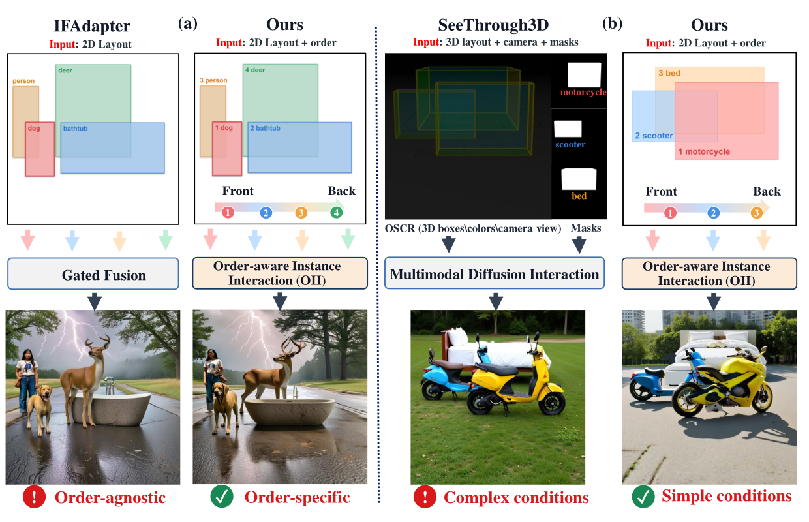
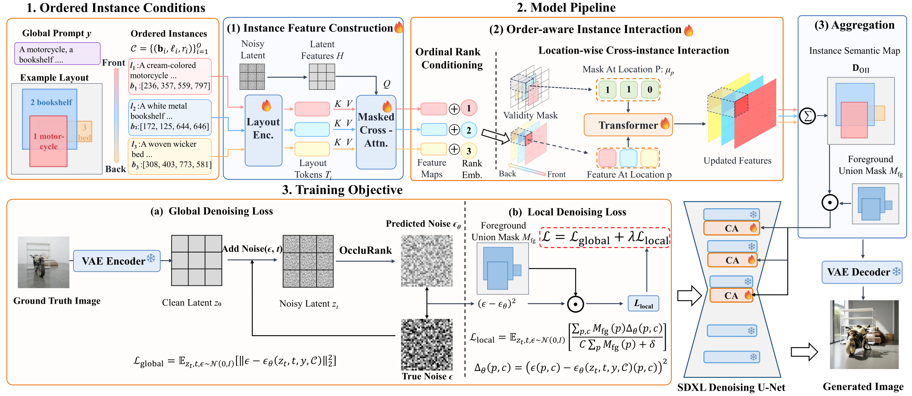

<div align="center">

# OccluRank

### Controllable Occlusion-Aware Layout-to-Image Generation by Adding Just an Ordinal Rank

Wenyang Hong<sup>1*</sup>, Yuan Wang<sup>2*</sup>, Yanbin Hao<sup>1&dagger;</sup>, Lanqing Xue<sup>3</sup>, Ke Wang<sup>4</sup>,  
Xiang Wang<sup>5</sup>, Kuien Liu<sup>1,6</sup>, Richang Hong<sup>1</sup>

<sup>1</sup>Hefei University of Technology &nbsp;&nbsp;
<sup>2</sup>School of Cyber Science and Technology, University of Science and Technology of China &nbsp;&nbsp;
<sup>3</sup>LCFC &nbsp;&nbsp;
<sup>4</sup>ByteDance Inc.  
<sup>5</sup>School of Artificial Intelligence and Data Science, University of Science and Technology of China &nbsp;&nbsp;
<sup>6</sup>Institute of Software, Chinese Academy of Sciences

<sup>*</sup>Equal contribution &nbsp;&nbsp; <sup>&dagger;</sup>Corresponding author

[Project Page](https://wenyang-hong.github.io/OccluRank/) |
[Paper](#paper-release) |
[Code](https://github.com/Wenyang-hong/OccluRank) |
[Dataset](#dataset-release) |
[Benchmark](#benchmark-release)

</div>

<p align="center">
  
</p>

OccluRank is a simple and controllable occlusion-aware layout-to-image framework. It extends each bounding-box condition with only one foreground-to-background ordinal rank and introduces **Order-aware Instance Interaction (OII)** so that overlapping, rank-conditioned instance representations can interact before aggregation.

## Motivation and contributions

**Motivation.** Bounding-box layouts specify where instances should appear but cannot express which instance should appear in front. Existing approaches may require complex geometric inputs or inference procedures, while independent instance aggregation does not explicitly model occlusion-dependent interactions. Meanwhile, the lack of reliable occlusion-aware training data and comprehensive evaluation protocols limits both model development and systematic assessment.

**Contributions.** Our work makes three contributions as a whole:

1. **Method — OccluRank.** We introduce a simple occlusion-aware layout-to-image framework that adds only one ordinal rank to each instance and uses Order-aware Instance Interaction (OII) to provide explicit, controllable occlusion order without extra geometric inputs or specialized inference-time optimization.
2. **Dataset — OccluLayout.** We construct a synthetic training dataset with geometry-derived front-to-back order, amodal boxes and masks, and fine-grained instance descriptions.
3. **Benchmark — OccluLayout-Bench.** We establish an evaluation benchmark that jointly measures instance presence, spatial layout, attributes, occlusion order, and overall image quality using multiple MLLMs together with FID.

## News and release status

- Training and inference code are available in this repository.
- The paper link will be added when the public preprint is available.
- OccluLayout, OccluLayout-Bench, and model checkpoints will be released separately.

## Method overview

<p align="center">
  
</p>

OccluRank follows an **interaction-before-aggregation** pipeline:

1. **Ordinal rank conditioning.** Each instance is assigned one rank according to the user-specified front-to-back order.
2. **Order-aware Instance Interaction.** OII jointly updates rank-conditioned representations at spatial locations covered by multiple instances.
3. **Masked feature injection.** The interacted features are aggregated into an Instance Semantic Map and residually injected into selected SDXL cross-attention layers.

## Installation

The reference environment uses Python 3.12, PyTorch 2.7.0, and CUDA 12.8.

```bash
git clone https://github.com/Wenyang-hong/OccluRank.git
cd OccluRank

conda create -n occlurank python=3.12 -y
conda activate occlurank

pip install torch==2.7.0 torchvision==0.22.0 --index-url https://download.pytorch.org/whl/cu128
pip install -r requirements.txt
```

Use the PyTorch command appropriate for your CUDA version if CUDA 12.8 is unavailable.

## Model weights

The inference entry point accepts either a local checkpoint path or an HTTP(S) checkpoint URL through `--adapter_path`.

| Checkpoint | Purpose | Download |
| --- | --- | --- |
| OccluRank checkpoint | Inference | Coming soon |
| Initialization checkpoint | Reproducing the paper training setup | Coming soon |

Downloaded checkpoints can be placed in `checkpoints/`; this directory is ignored by Git.

## Quick start

The repository includes one ordered-layout example at `examples/layouts/example.json`. After downloading the OccluRank checkpoint, edit `CHECKPOINT` in `configs/paper_infer.sh`, then run:

```bash
bash configs/paper_infer.sh
```

Generated images are written to `outputs/example/images/`. Layout visualizations with colored boxes are written to `outputs/example/layout/`.

## Inference data format

`--dataset_txt_path` points to a text file containing one layout JSON path per line. Each JSON file contains a global caption and an annotation list ordered from foreground to background:

```json
{
  "caption": "A cream-colored sportbike is parked on a concrete floor, with a white metal shelving unit and a woven wicker bed behind it.",
  "annotations": [
    {
      "box": [177.0, 267.75, 242.25, 330.0],
      "caption": ["cream-colored sportbike viewed from rear, parked on concrete floor"]
    },
    {
      "box": [129.0, 93.75, 354.0, 390.75],
      "caption": ["white metal shelving unit with four horizontal shelves, empty"]
    },
    {
      "box": [231.0, 302.25, 348.75, 133.5],
      "caption": ["woven wicker frame with beige mattress and brown blanket, against wall"]
    }
  ]
}
```

Important conventions:

- `annotations` must be ordered from foreground to background.
- Each `box` uses COCO-style `xywh` coordinates.
- OccluLayout-Bench boxes are defined on a 768 x 768 annotation canvas and are normalized internally.
- The generation resolution is controlled independently by `--resolution`.
- Inputs with more than `--max_obj` valid instances are subsampled while preserving their relative order.

A direct inference command is:

```bash
python infer_occlurank.py \
  --pretrained_model_name_or_path stabilityai/stable-diffusion-xl-base-1.0 \
  --adapter_path checkpoints/occlurank_step_00001500.ckpt \
  --dataset_txt_path examples/infer.txt \
  --output_path outputs/example \
  --resolution 1024 \
  --num_inference_steps 30 \
  --guidance_scale 7.5 \
  --model_variant lrt \
  --order_position_encoding learned \
  --interaction_depth 1 \
  --rank_embedding_capacity 10
```

## Training data format

`train_occlurank.py` reads one parquet file or every parquet file in a directory. Each row must contain:

- `image_path`: path relative to `--image_root`;
- `metadata.global_caption`: global image description;
- `metadata.bbox_info`: ordered instance annotations;
- optionally, `metadata.image_info.width` and `metadata.image_info.height`.

Each item in `metadata.bbox_info` contains an absolute `xyxy` box in `bbox` and an instance description in `detail_description`. The order of `bbox_info` is interpreted as foreground to background.

## Training

Edit the paths at the top of `configs/paper_train.sh`, then run:

```bash
bash configs/paper_train.sh
```

The paper configuration uses SDXL-base-1.0 at 1024 resolution, batch size 4, gradient accumulation 40, 1,500 optimizer steps, learning rate `1e-4`, BF16 mixed precision, global/local loss weights `1.0/2.0`, at most five instances, OII depth 1, learned rank embeddings, and seed 42.

Checkpoints are saved as `checkpoint_step_XXXXXXXX.ckpt`. `--initial_adapter_checkpoint` may be supplied to reproduce the paper setup or omitted to initialize the trainable modules from scratch.

## Dataset release

**OccluLayout** is a synthetic training dataset with geometry-derived front-to-back order, amodal boxes and masks, global captions, and fine-grained instance descriptions. It contains 33,496 training images and 114,047 annotated instances.

The public download link will be added here after release.

## Benchmark release

**OccluLayout-Bench** contains 1,000 held-out images with 3,386 annotated instances. It evaluates instance presence, spatial adherence, attribute consistency, occlusion order, and overall image quality.

The benchmark data and evaluation resources will be linked here after release.

## Repository structure

```text
OccluRank/
|-- configs/
|   |-- paper_infer.sh
|   `-- paper_train.sh
|-- examples/
|   |-- infer.txt
|   `-- layouts/example.json
|-- occlurank/
|   |-- attention.py
|   |-- conditioning.py
|   |-- inference_data.py
|   |-- model.py
|   |-- pipeline.py
|   `-- training_data.py
|-- infer_occlurank.py
|-- train_occlurank.py
`-- requirements.txt
```

## Paper release

The public paper link and final BibTeX entry will be added after the preprint is available.

## Acknowledgements

This implementation builds on PyTorch, Hugging Face Diffusers, Transformers, Accelerate, OpenFlamingo, and imagen-pytorch. Attribution and upstream license headers are retained in the corresponding source files.

## Citation

The final BibTeX entry will be added after the public paper identifier is assigned.
